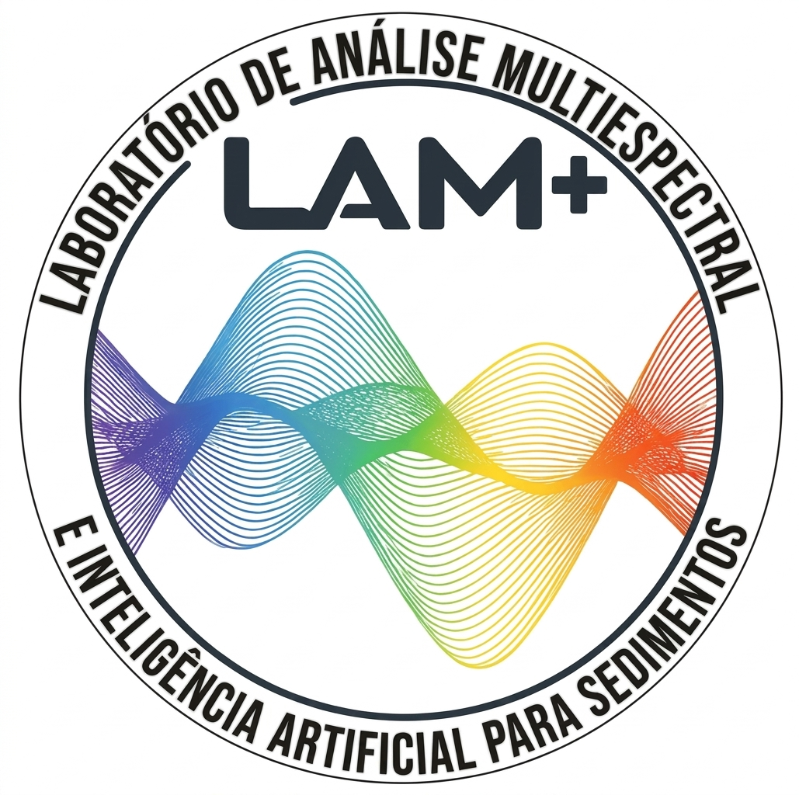

<p align="center">
  
</p>

# LAM+

**Main repository of the LAM+ GitHub organization.**

**Laboratório de Análise Multiespectral e Inteligência Artificial para Sedimentos**  
**Laboratory for Multispectral Analysis and Artificial Intelligence for Sediments**

---

This repository hosts the public GitHub profile of **LAM+**, a laboratory platform dedicated to high-resolution sedimentary sequence analysis, integrating multispectral methods, hyperspectral imaging, XRF core scanning, and artificial intelligence.

🌐 **Website:** https://lamplus.org  
🏛️ **Institution:** Universidade Federal Fluminense — Niterói, Rio de Janeiro, Brazil

---

## About LAM+

LAM+ is being developed as an institutional and scientific platform for the integrated analysis of sedimentary archives, combining laboratory instrumentation, computational workflows, and artificial intelligence methods to support research in sedimentology, paleoceanography, paleoclimatology, and environmental reconstruction.

## Repository purpose

This repository contains the organization-level GitHub profile README.

For the institutional website, see:

```text
lam-plus.github.io
